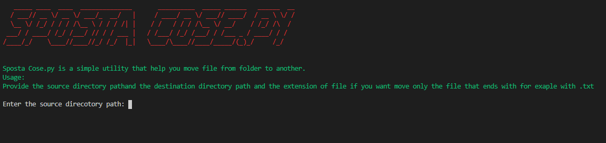

# Why i created Sposta Cose.py
 Because i'm to lazy to drag and drop some file from one folder to another, in my case i need to move all the .jpg file in that folder but there are another file and i'm to lazy to move only the photo, so i created Sposta Cose.py

# Library i used
* [Termcolor](https://pypi.org/project/termcolor/) for the font color and other bold text
* [pyfiglet](https://pypi.org/project/pyfiglet/) for the ascii art

# Usage
Download the script and move to the direcotry where is located


if you are under windows use this command ```python spostacose.py```


if you are under Linux or macOS please verify your version of python, i recommend you to use python 3 if so use this command ```python3 spostacose.py``` or ```python2 spostacose.py```

# Contributing
If you want contribute please feel free to do it, send a pr or write me and explaing me what is better, i want to learn new things :)
